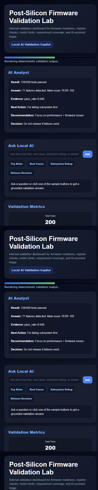

# Post-Silicon Firmware Validation Lab

Post-Silicon Firmware Validation Lab is a local validation tool for reviewing firmware readiness, register checks, subsystem state, and SSD/NVMe validation signals.

## Product Screenshot



It uses deterministic validation checks as the source of truth and adds a local AI validation copilot to explain release risk and next debug steps.

## What It Does

- Loads firmware and validation sample data.
- Checks subsystem readiness, register-level signals, and validation status.
- Produces a structured validation summary.
- Displays readiness and risk in a browser UI.
- Provides AI analyst and chat-style validation guidance.

## AI Features

- Local AI validation copilot explains readiness risk.
- AI recommendations reference deterministic validation evidence.
- Helps convert low-level validation signals into operator-ready next steps.
- Browser UI shows validation state and AI analyst output.

## Architecture

```text
Firmware validation data
        |
        v
Validation checks -> readiness summary -> risk notes
        |
        v
Local AI validation copilot -> explanation + next debug action
        |
        v
Browser dashboard
```

## Run

```powershell
run.bat
```

## Local AI Setup

Use a local OpenAI-compatible model server such as LM Studio. A small model such as `google/gemma-4-e4b` is enough for the analyst layer.

Core validation checks run without AI.

## Main Files

- `app.py` - validation dashboard and AI analyst UI.
- `agents/Agent.md` - post-silicon validation copilot instructions.
- `samples/` - validation data.

## Output

The app shows firmware readiness, validation risk, subsystem notes, and AI-generated release or debug guidance.
